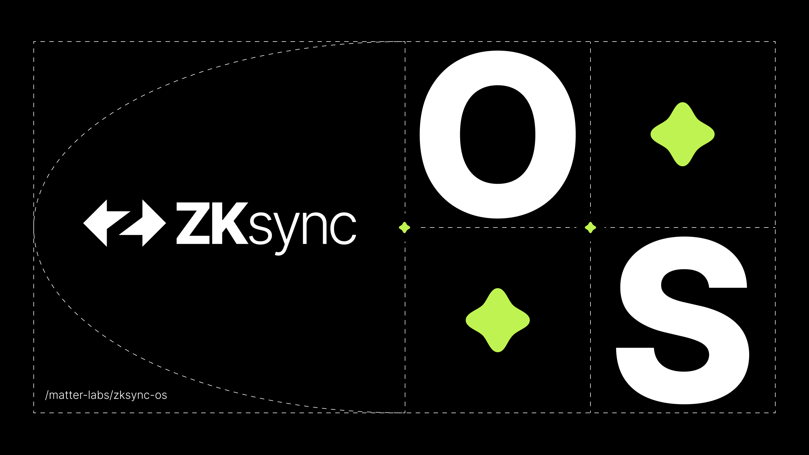

# ZKsync OS

[](https://zksync.io/)

ZKsync OS is a new state transition function implementation that enables multiple execution environments (EVM, EraVM, Wasm, etc.) to operate within a unified ecosystem. It is implemented in Rust and compiled into a RISC-V binary, which can later be proven using the `zksync-airbender`.

## Documentation

The most recent documentation can be found here:

- [In-repo documentation](./docs/README.md)

## Crates

The project contains the following crates (the list is not complete):

* [zk_ee](./zk_ee/) - execution environment
* [zksync_os](./zksync_os/) - operating system - that can handle multiple execution environments. Compiled into RISC-V.
* [zksync_os_runner](./zksync_os_runner/) -  allows running programs on zksync_os using RISC-V simulator.
* [basic_system](./basic_system/) - basic implementation of zk_ee::system and system functions
* [basic_bootloader](./basic_bootloader/) - implementation of bootloader and main execution loop
* [evm_interpreter](./evm_interpreter/) - EVM execution environment
* [forward_system](./forward_system/) - implementation for "forward" running (sequencing)

## How to build

### One-Time Setup
Run the following commands to prepare your environment (only needed once):

```
rustup target add riscv32i-unknown-none-elf
cargo install cargo-binutils && rustup component add llvm-tools-preview
```

ZKsync OS should be built for 2 targets:
- your platform, this will be used in the sequencer to execute blocks
- RISC-V, this is a program that will be proved using RISC-V prover

### Build for your platform
```
cargo build --release
```

### Build for RISC-V

Navigate to the `zksync_os` directory and run:
```
./dump_bin.sh
```

## Testing

### Integration tests

**To run the integration tests you should build ZKsync OS first, see `building` section above**

Integration tests located in the `tests` folder. You can run them as regular cargo tests.

For example to run basic tests that executes a few ERC-20 calls using different tx types use:
```
cargo test --release -p transactions -- --nocapture
```

### Proving

You can run proving by enabling `e2e_proving` feature while running a tests, for example:
```
cargo test --release --features e2e_proving -p transactions -- --nocapture
```

### Alternative proving workflow with Prover CLI

**Generating the CRS File**

You can set `CSR_READS_DUMP` env variable to dump csr reads for proving(witnesses) and then run any test.
It will create csr file with path `CSR_READS_DUMP`.

**Using the Prover CLI**

The Prover CLI is part of the `zksync-airbender` repository, located in the [tools/cli](https://github.com/matter-labs/zksync-airbender/tree/main/tools/cli) directory.

Run the following from the zksync-airbender repository:

```
mkdir zkee_output

cargo run --profile cli --no-default-features -p cli prove --bin ../zksync-os/zksync_os/app.bin --input-file ${CSR_READS_DUMP} --output-dir zkee_output
```

This generates multiple proof files in the `zkee_output` directory. For recursion (compressing proofs into fewer files), refer to the instructions in the `zksync-airbender` repository.


### Proving workflow with anvil-zksync

1. Build ZKsync OS
2. Run anvil-zksync
3. Send transactions
4. Tell prover cli to get the witnesses from anvil-zksync

**Anvil ZKsync**

Run [anvil-zksync from github](https://github.com/matter-labs/anvil-zksync) - **IMPORTANT** - make sure to use `zkos-dev` branch.

```shell
cargo run  -- --use-zkos --zkos-bin-path=../zksync-os/zksync_os/app.bin
```

**Send transactions**

You can use any tool (for example forge) - to send transactions to the anvil binary.

**Tell prover cli to get the witnesses from anvil-zksync**

From the zksync-airbender repo:
```
    cargo run --no-default-features -- run --bin ../zksync-os/zksync_os/app.bin --input-rpc http://localhost:8012 --input-batch 15
```

You can get the witness via the RPC call, where you pass the batch id as parameter:

```
http POST http://127.0.0.1:8011 \
    Content-Type:application/json \
    id:=1 jsonrpc="2.0" method="zkos_getWitness" params:='[1]'
```

## Policies

- [Security policy](SECURITY.md)
- [Contribution policy](CONTRIBUTING.md)

## License

ZKsync OS is distributed under the terms of either

- Apache License, Version 2.0, ([LICENSE-APACHE](LICENSE-APACHE) or <http://www.apache.org/licenses/LICENSE-2.0>)
- MIT license ([LICENSE-MIT](LICENSE-MIT) or <https://opensource.org/blog/license/mit/>)

at your option.

## Official Links

- [Website](https://zksync.io/)
- [GitHub](https://github.com/matter-labs)
- [ZK Credo](https://github.com/zksync/credo)
- [Twitter](https://twitter.com/zksync)
- [Twitter for Developers](https://twitter.com/zkSyncDevs)
- [Discord](https://join.zksync.dev/)
- [Mirror](https://zksync.mirror.xyz/)
- [Youtube](https://www.youtube.com/@zkSync-era)
