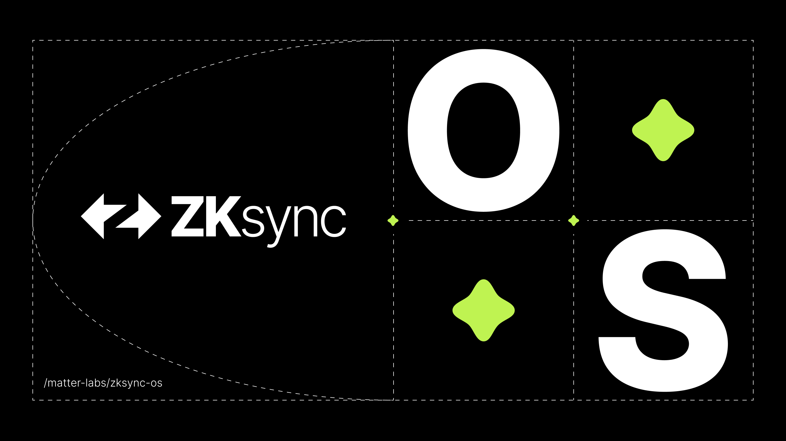

# ZKsync OS

[](https://zksync.io/)

ZKsync OS is a new state transition function implementation that enables multiple execution environments (EVM, EraVM, Wasm, etc.) to operate within a unified ecosystem. It is implemented in Rust and compiled into a RISC-V binary, which can later be proven using the `zksync-airbender`.

## Documentation

The most recent documentation can be found here:

- [In-repo documentation](./docs/README.md)
- [Repository structure](./docs/repository_structure.md)

## How to build

### One-Time Setup
Run the following commands to prepare your environment (only needed once):

```
rustup target add riscv32i-unknown-none-elf
cargo install cargo-binutils && rustup component add llvm-tools-preview
```

ZKsync OS can be built for 2 targets:
- your platform, this will be used in the sequencer to execute blocks
- RISC-V, this is a program that will be proved using RISC-V prover

### Build for host platform
```
cargo build --workspace
```

### Build for RISC-V

#### Reproducible build

To build RISC-V binaries in an reproducible way use the following command (requires Docker):

```
./zksync_os/reproduce/reproduce.sh
```

#### Manual build

Navigate to the `zksync_os` directory and run:
```
./dump_bin.sh --type for-tests
```

For other build modes, check `zksync_os/dump_bin.sh`.

## Testing

### Integration tests

Build `zksync_os` first for tests that execute the proof-running path:
```bash
cd zksync_os && ./dump_bin.sh --type for-tests
```

Run workspace tests:
```bash
cargo test --workspace
```

Note: `cargo test --workspace` does **not** include directories excluded in root `Cargo.toml` (for example `zksync_os`, `tests/fuzzer`, `tests/evm_tester`, `tests/instances/eth_runner`).

Integration tests are mainly organized in `tests/instances/` using the rig in `tests/rig/`.

Examples:
```
cargo test -p transactions -- --nocapture
cargo test -p precompiles -- --nocapture
cargo test -p unit
```

### Proving tests execution

You can run proving by enabling the `e2e_proving` feature while running tests, for example:
```
cargo test --features e2e_proving -p transactions -- --nocapture
```

Alternatively tests can be proven manually: [Proving tests with](./docs/proving_tests_with_cli.md).

### EVM Tester

The repository also contains the EVM tester setup in `tests/evm_tester`.

Prepare fixtures once:
```bash
cd tests/evm_tester && ./download_ethereum_fixtures.sh
```

Run:
```bash
cd tests/evm_tester && cargo run --bin evm-tester --release --features zksync_os_forward_system/no_print
```

## Policies

- [Security policy](SECURITY.md)
- [Contribution policy](CONTRIBUTING.md)

## License

ZKsync OS is distributed under the terms of either

- Apache License, Version 2.0, ([LICENSE-APACHE](LICENSE-APACHE) or <http://www.apache.org/licenses/LICENSE-2.0>)
- MIT license ([LICENSE-MIT](LICENSE-MIT) or <https://opensource.org/blog/license/mit/>)

at your option.

## Official Links

- [Website](https://zksync.io/)
- [GitHub](https://github.com/matter-labs)
- [ZK Credo](https://github.com/zksync/credo)
- [Twitter](https://twitter.com/zksync)
- [Twitter for Developers](https://twitter.com/zkSyncDevs)
- [Discord](https://join.zksync.dev/)
- [Mirror](https://zksync.mirror.xyz/)
- [Youtube](https://www.youtube.com/@zkSync-era)
