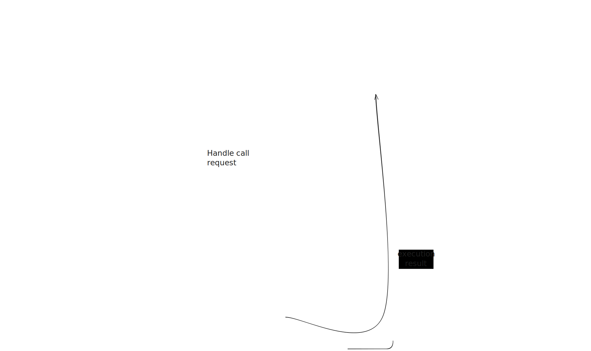

# Runner flow

This section describes how the bootloader interacts with the execution environments to run contract code. This section is complemented by [Execution Environments](../execution_environments/execution_environments.md).

## Entrypoints

The bootloader implements (and uses) two entrypoints for code execution.

The first one is `run_till_completion` from the [`runner`](../../basic_bootloader/src/bootloader/runner.rs) module of the bootloader. This function implements the main execution loop given an initial request (either external call or deployment), which is explained in the next section.

 The second one, [`run_single_interaction`](../../basic_bootloader/src/bootloader/run_single_interaction.rs), is just a simple wrapper over the previous to simplify external calls from the bootloader. It just adds the logic for starting and finishing the topmost execution frame and prepares the inputs for `run_till_completion`.

## Runner structure

The runner's responsibility is to coordinate calls into the execution environments. For this, the runner keeps a callstack of execution environment states and will be responsible of starting and finishing system frames. Frames are used to take snapshots for storage and memory to which the system can revert to in case of a failure.

The runner is implemented as an infinite loop that dispatches the preemption reasons returned by the execution environment. As a reminder, these are:

- External call request,
- Deployment request,
- External call completed, and
- Deployment completed.

The runner breaks out of the infinite loop after processing the completion of the initial request (when the callstack becomes empty).

### Call request

For the external call request, the bootloader needs to:

1. Start frame for call.
2. Run the call preparation in the system, this will return the callee's bytecode, transfer token value and charge gas according to the EE's policy.
3. Create a new EE state for the call and push it to the callstack.
4. Call into the newly created EE to start executing the frame.

There's a special case in which the callee is a special address (for example, precompile or system contract). In this case the flow is similar, but there's no new EE. Instead, the [System Hooks](../system_hooks.md) are used.

### Deployment request

For deployment request, the bootloader needs to:

1. Start frame for deployment preparation.
2. Call into EE to run deployment preparation. This will compute the deployed address, perform some checks and charge gas.
3. Create new EE state for constructor using the output from the previous call and push it to the callstack.
4. Start frame for constructor execution.
5. Set nonce to 1 (see EIP-161).
6. Perform token transfer.
7. Call into the newly created EE to start executing the constructor frame.

### Call completed

When the EE returns with a completed call, the runner has to:

1. Perform a selfdestruct if the execution ended up in that state.
2. Pop the caller from the callstack.
3. Finish callee frame, reverting if the execution ended in a reverting state.
4. Copy return data into the return memory of the caller.
5. Continue execution of the caller.

### Deployment completed

When the EE returns with a completed deployment, the runner has to:

1. Perform a selfdestruct if the execution ended up in that state.
2. If the constructor execution was successful, ask the system to actually deploy the code.
3. Finish the constructor frame, reverting if the constructor ended in a revert state.
4. Pop the deployer from the callstack.
5. Finish the deployment preparation frame, reverting only if deployment preparations failed.
6. Copy return data into the return memory of the deployer.
7. Continue execution of the deployer.

## Flow diagram

We illustrate the flow of an interaction in which an EOA transaction execution calls a contract that, in turn, deploys a new contract. The entry point in the following diagram is `Run single interaction`, which is called by the EOA transaction execution, as described in [Transaction processing](./transaction_processing.md).

In this diagram, the dotted lines from the EE to the bootloader are conceptual. In the implementation, the bootloader calls into the EE and handles the return value in the next iteration of the main loop.
